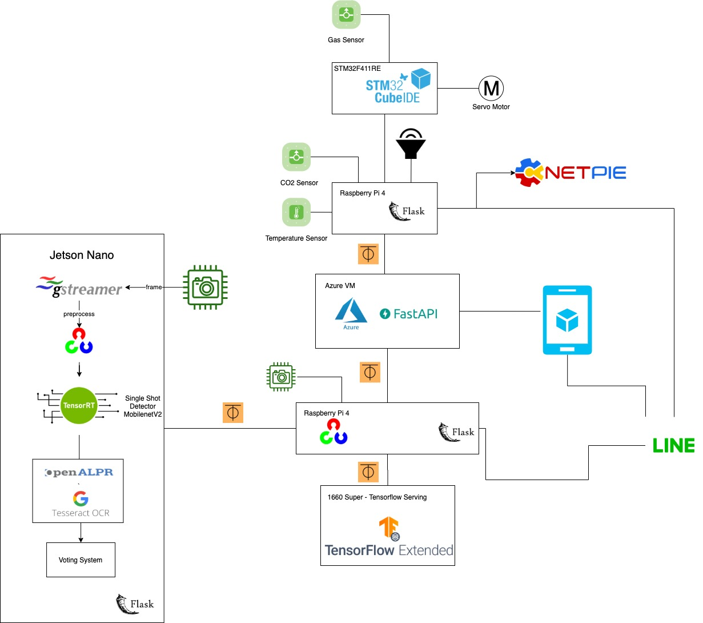

# ALPR-IoT

ALPR using Nvidia Jetson Nano and Raspberry Pi for (2147336) Internet of Things

## Components
---
- Raspberry Pi 4 x 2
- Nvidia Jetson Nano
- Nucleo STM32F411RE
- Raspberry Pi Camera
- IMX219 Camera
- Servo
- Buzzer
- MQ-2 Gas Sensor
- CCS811 Carbon Dioxide Sensor
- DHT22 High Accuracy Digital Temperature and Humidity Sensor

## Models
---
- TensorRT SSD MobilenetV2
- OpenALPR
- TessaractOCR
- License Plate Detector (Faster RCNN InceptionV2)

## System Diagram
---

## Example
---

